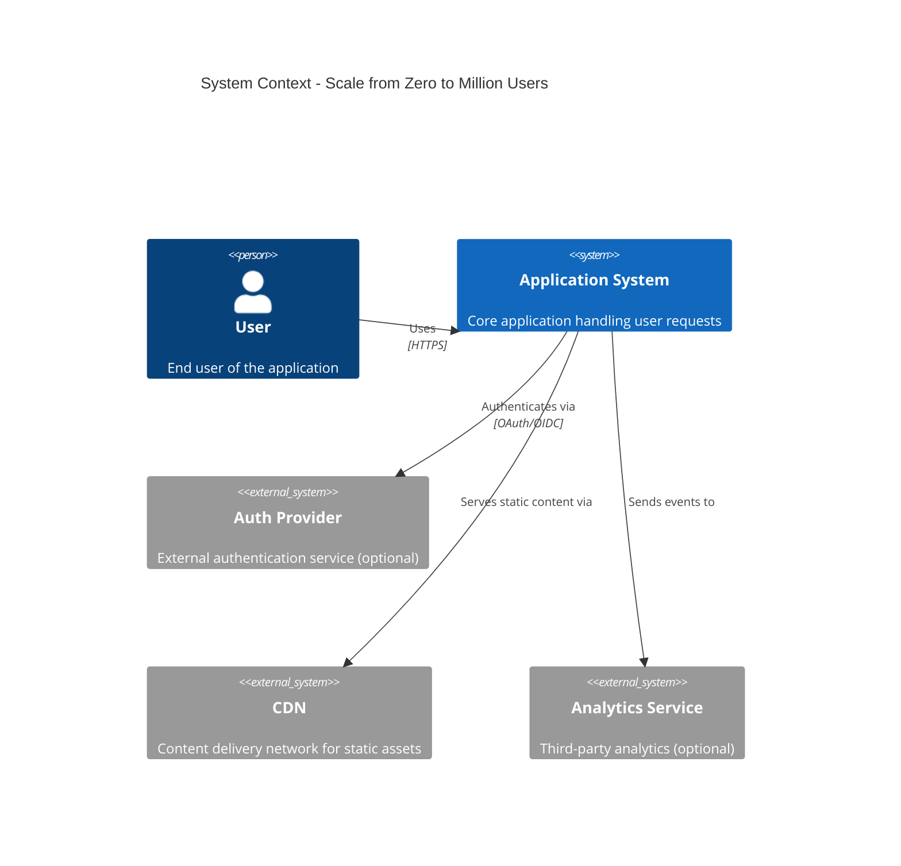

# Scale from Zero to Million Users - Context Diagram

## System Context

This diagram shows the system and its relationships with users and external systems.



## ASCII Fallback

```text
┌─────────┐
│  User   │
└────┬────┘
     │ Uses (HTTPS)
     │
┌────▼────────────────────────────┐
│   Application System            │
│   (Core application)            │
└────┬────────────────────────────┘
     │
     ├──► Auth Provider (OAuth/OIDC)
     ├──► CDN (Static content)
     └──► Analytics Service (Events)
```

## Key Relationships

- **Users** interact with the Application System via HTTPS
- **Application System** may integrate with external Auth Provider for authentication
- **CDN** serves static assets to reduce load on application servers
- **Analytics Service** receives events for monitoring and analysis

