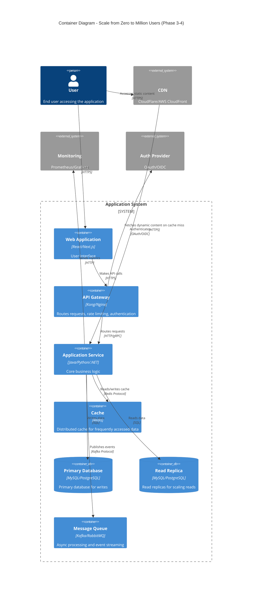

# Scale from Zero to Million Users - Container Diagram

## Container Diagram (Phase 3-4 Architecture)

This diagram shows the high-level technical building blocks (containers) that make up the system at scale.



## ASCII Fallback

```text
┌─────────┐
│  User   │
└────┬────┘
     │
     ├─────────────────┐
     │                 │
     ▼                 ▼
┌──────────┐      ┌─────────┐
│ Web App  │      │   CDN   │
└────┬─────┘      └─────────┘
     │
     ▼
┌─────────────────┐
│  API Gateway    │
└────────┬────────┘
     │
     ├──► Auth Provider
     │
     ▼
┌─────────────────┐
│ Application     │
│ Service         │
└────┬────────────┘
     │
     ├──► Cache (Redis)
     ├──► Primary DB (writes)
     ├──► Read Replica (reads)
     └──► Message Queue
```

## Phase Evolution

### Phase 1: Single Container
- Application + Database on single server

### Phase 2: Basic Separation
- Application Server
- Database + Read Replicas
- Basic Cache

### Phase 3: Distributed Containers
- Multiple Application Servers
- Load Balancer
- Database Cluster
- Distributed Cache
- Message Queue

### Phase 4: Microservices
- Multiple Services
- API Gateway
- Service Mesh
- Distributed Databases
- Event Streaming

## Key Containers

1. **Web Application**: User interface layer
2. **API Gateway**: Entry point, routing, rate limiting
3. **Application Service**: Core business logic
4. **Cache**: High-speed data access
5. **Database**: Persistent data storage
6. **Message Queue**: Async processing and events

