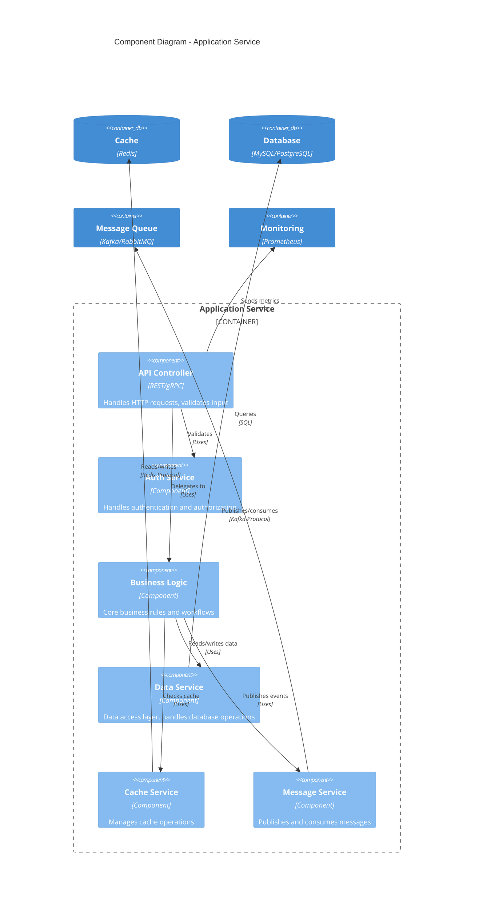

# Scale from Zero to Million Users - Component Diagram

## Component Diagram (Application Service)

This diagram shows the internal components of the Application Service container.



## ASCII Fallback

```text
┌─────────────────────────────────┐
│     Application Service         │
│                                 │
│  ┌──────────────┐              │
│  │ API Controller│              │
│  └──────┬───────┘               │
│         │                       │
│    ┌────▼────┐                 │
│    │  Auth   │                 │
│    │ Service │                 │
│    └─────────┘                 │
│         │                       │
│  ┌──────▼──────────┐           │
│  │ Business Logic  │           │
│  └──────┬──────────┘           │
│         │                       │
│    ┌────▼────┐  ┌──────┐       │
│    │  Data  │  │Cache │       │
│    │ Service│  │Service│       │
│    └────┬───┘  └───┬──┘       │
│         │          │           │
│    ┌────▼──────────▼──┐       │
│    │ Message Service  │       │
│    └──────────────────┘       │
└────────┬───────────┬───────────┘
         │           │
    ┌────▼───┐  ┌───▼────┐
    │Database│  │ Cache  │
    └────────┘  └────────┘
         │
    ┌────▼────┐
    │ Message │
    │  Queue  │
    └─────────┘
```

## Component Responsibilities

### API Controller
- Receives HTTP/gRPC requests
- Validates input parameters
- Handles request/response serialization
- Returns appropriate HTTP status codes

### Auth Service
- Validates authentication tokens
- Checks user permissions
- Manages session state
- Integrates with external auth providers

### Business Logic
- Implements core business rules
- Orchestrates workflows
- Validates business constraints
- Coordinates between services

### Data Service
- Abstracts database access
- Implements data access patterns (Repository, DAO)
- Handles transactions
- Manages connection pooling

### Cache Service
- Manages cache operations (get, set, delete)
- Implements cache strategies (cache-aside, write-through)
- Handles cache invalidation
- Manages cache keys and TTLs

### Message Service
- Publishes events to message queue
- Consumes messages from queue
- Handles message serialization
- Implements retry logic

## Component Interactions

1. **Request Flow**: API Controller → Auth Service → Business Logic → Data/Cache Service
2. **Cache Flow**: Business Logic → Cache Service → Cache (if miss, then Data Service → Database)
3. **Event Flow**: Business Logic → Message Service → Message Queue
4. **Monitoring**: All components send metrics to Monitoring system

