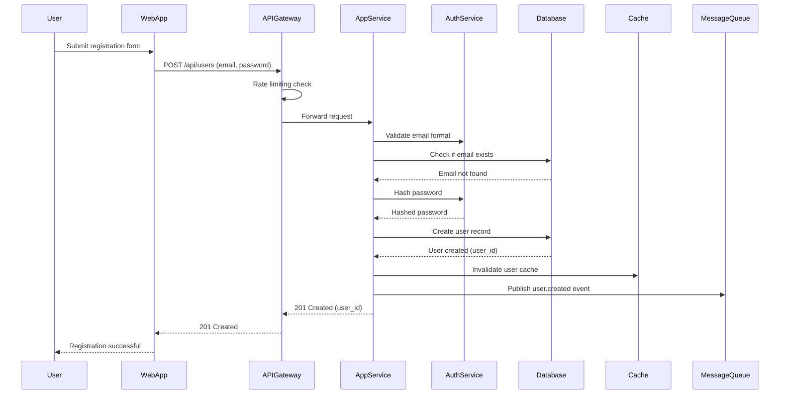

# User Registration Flow - Sequence Diagram

## User Registration Sequence

This diagram shows the flow when a new user registers in the system.



## ASCII Fallback

```
User          WebApp        API Gateway   App Service   Auth Service  Database    Cache    Message Queue
 │              │              │              │              │            │          │            │
 │ Submit form  │              │              │              │            │          │            │
 ├─────────────>│              │              │              │            │          │            │
 │              │ POST /api/users            │              │            │          │            │
 │              ├───────────────────────────>│              │            │          │            │
 │              │              │ Rate limit  │              │            │          │            │
 │              │              ├─────────────>│              │            │          │            │
 │              │              │             │ Validate email│            │          │            │
 │              │              │             ├──────────────>│            │          │            │
 │              │              │             │ Check email exists         │          │            │
 │              │              │             ├────────────────────────────>│          │            │
 │              │              │             │<────────────────────────────┤          │            │
 │              │              │             │ Hash password              │          │            │
 │              │              │             ├──────────────>│            │          │            │
 │              │              │             │<──────────────┤            │          │            │
 │              │              │             │ Create user                │          │            │
 │              │              │             ├────────────────────────────>│          │            │
 │              │              │             │<────────────────────────────┤          │            │
 │              │              │             │ Invalidate cache          │          │            │
 │              │              │             ├────────────────────────────>│          │            │
 │              │              │             │ Publish event              │          │            │
 │              │              │             ├───────────────────────────────────────────────────>│
 │              │              │             │ 201 Created               │          │            │
 │              │              │<─────────────┤                           │          │            │
 │              │<──────────────┤             │                           │          │            │
 │<─────────────┤              │             │                           │          │            │
```

## Flow Description

1. **User submits registration form** with email and password
2. **WebApp sends request** to API Gateway
3. **API Gateway** performs rate limiting check
4. **AppService** validates email format via AuthService
5. **Database** checks if email already exists
6. **AuthService** hashes the password
7. **Database** creates new user record
8. **Cache** is invalidated to ensure fresh data
9. **MessageQueue** receives user.created event for downstream processing
10. **Response** is returned to user with user_id

## Error Scenarios

- **Email already exists**: Return 409 Conflict
- **Invalid email format**: Return 400 Bad Request
- **Weak password**: Return 400 Bad Request
- **Rate limit exceeded**: Return 429 Too Many Requests
- **Database error**: Return 500 Internal Server Error


