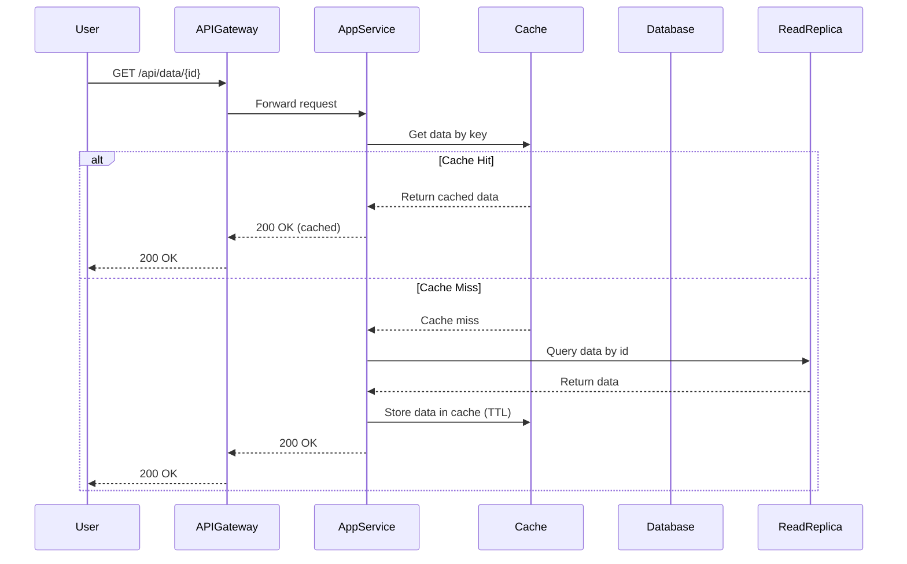
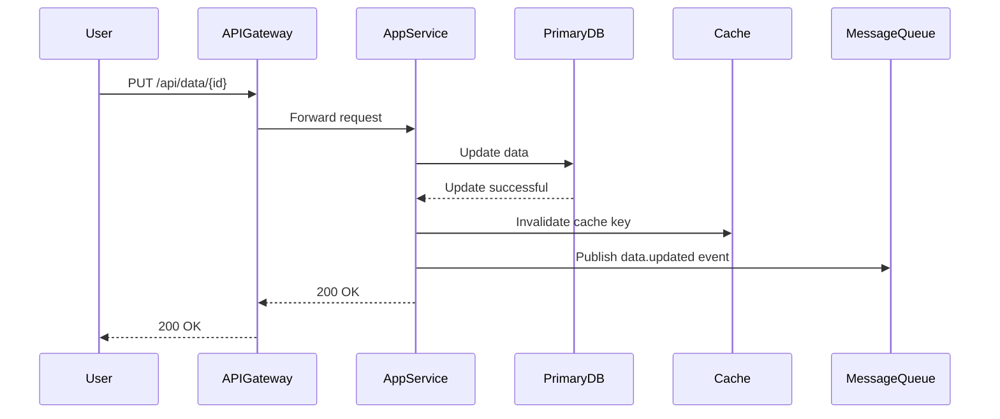

# Data Access Flow - Sequence Diagram

## Read Operation with Cache (Phase 3-4)

This diagram shows the flow when reading data with cache-aside pattern.



## Write Operation (Phase 3-4)



## ASCII Fallback - Read Flow

```text
User    API Gateway   App Service   Cache      Read Replica
 │           │             │           │            │
 │ GET /api/data/{id}      │           │            │
 ├──────────>│             │           │            │
 │           ├────────────>│           │            │
 │           │             │ Get by key│            │
 │           │             ├──────────>│            │
 │           │             │           │            │
 │           │             │ Cache Hit │            │
 │           │             │<──────────┤            │
 │           │             │           │            │
 │           │<────────────┤           │            │
 │<──────────┤             │           │            │
```

## ASCII Fallback - Write Flow

```text
User    API Gateway   App Service   Primary DB   Cache    Message Queue
 │           │             │             │          │            │
 │ PUT /api/data/{id}      │             │          │            │
 ├──────────>│             │             │          │            │
 │           ├────────────>│             │          │            │
 │           │             │ Update data │          │            │
 │           │             ├────────────>│          │            │
 │           │             │<────────────┤          │            │
 │           │             │ Invalidate cache      │            │
 │           │             ├───────────────────────>│            │
 │           │             │ Publish event         │            │
 │           │             ├───────────────────────────────────>│
 │           │<────────────┤             │          │            │
 │<──────────┤             │             │          │            │
```

## Flow Description

### Read Operation (Cache-Aside Pattern)

1. **User requests data** via API Gateway
2. **AppService checks cache** first
3. **If cache hit**: Return cached data immediately
4. **If cache miss**: 
   - Query Read Replica database
   - Store result in cache with TTL
   - Return data to user

### Write Operation

1. **User updates data** via API Gateway
2. **AppService writes** to Primary Database
3. **Cache is invalidated** to ensure consistency
4. **Event is published** to Message Queue for downstream processing
5. **Response** is returned to user

## Performance Characteristics

- **Cache Hit**: ~1-5ms latency
- **Cache Miss**: ~10-50ms latency (database query)
- **Write Operation**: ~20-100ms latency (database write + cache invalidation)

## Phase Differences

- **Phase 1-2**: Direct database access, no cache
- **Phase 3**: Cache-aside pattern with Redis
- **Phase 4**: Multi-layer caching (L1: app cache, L2: Redis, L3: CDN)

