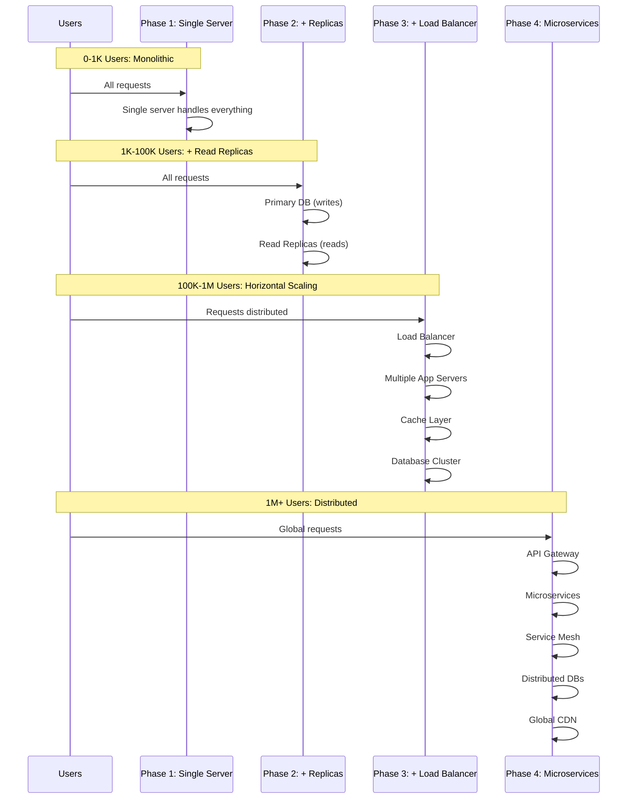

# Scaling Evolution - Sequence Diagram

## Infrastructure Evolution Across Phases

This diagram shows how the system architecture evolves as user base grows.



## ASCII Fallback

```
Phase 1 (0-1K Users): Monolithic
┌─────────────────────────────────┐
│  Users                          │
│     │                           │
│     ▼                           │
│  ┌──────────────┐               │
│  │ Single Server│               │
│  │ (App + DB)   │               │
│  └──────────────┘               │
└─────────────────────────────────┘

Phase 2 (1K-100K Users): + Read Replicas
┌─────────────────────────────────┐
│  Users                          │
│     │                           │
│     ▼                           │
│  ┌──────────────┐               │
│  │ App Server   │               │
│  └──────┬───────┘               │
│         │                       │
│    ┌────▼────┐  ┌──────────┐   │
│    │Primary  │  │  Read    │   │
│    │   DB    │  │ Replicas │   │
│    └─────────┘  └──────────┘   │
└─────────────────────────────────┘

Phase 3 (100K-1M Users): Horizontal Scaling
┌─────────────────────────────────┐
│  Users                          │
│     │                           │
│     ▼                           │
│  ┌──────────────┐               │
│  │Load Balancer │               │
│  └──────┬───────┘               │
│         │                       │
│    ┌────▼────┐  ┌──────────┐   │
│    │ App     │  │  App     │   │
│    │Server 1 │  │Server 2  │   │
│    └────┬────┘  └────┬─────┘   │
│         │            │          │
│    ┌────▼────────────▼────┐   │
│    │   Cache (Redis)       │   │
│    └────┬──────────────────┘   │
│         │                       │
│    ┌────▼──────────────┐       │
│    │  Database Cluster │       │
│    └───────────────────┘       │
└─────────────────────────────────┘

Phase 4 (1M+ Users): Microservices
┌─────────────────────────────────┐
│  Users                          │
│     │                           │
│     ▼                           │
│  ┌──────────────┐               │
│  │ API Gateway  │               │
│  └──────┬───────┘               │
│         │                       │
│    ┌────▼────┐  ┌──────────┐   │
│    │ User    │  │  Data    │   │
│    │ Service │  │ Service  │   │
│    └─────────┘  └──────────┘   │
│         │            │          │
│    ┌────▼────────────▼────┐   │
│    │  Service Mesh        │   │
│    └────┬─────────────────┘   │
│         │                       │
│    ┌────▼──────────────┐       │
│    │ Distributed DBs   │       │
│    └───────────────────┘       │
└─────────────────────────────────┘
```

## Evolution Timeline

### Phase 1 → Phase 2
**Trigger**: Database becomes bottleneck
**Changes**:
- Add read replicas
- Separate read and write operations
- Basic caching

### Phase 2 → Phase 3
**Trigger**: Single server can't handle load
**Changes**:
- Add load balancer
- Multiple application servers
- Distributed cache
- Database sharding or clustering

### Phase 3 → Phase 4
**Trigger**: Monolith limits independent scaling
**Changes**:
- Break into microservices
- API Gateway
- Service mesh
- Event-driven architecture
- Global distribution

## Key Metrics at Each Phase

| Phase | Users | QPS | Latency | Availability | Cost/Month |
|-------|-------|-----|---------|--------------|------------|
| 1 | 1K | 100 | <200ms | 99% | $50-100 |
| 2 | 100K | 1K | <150ms | 99.5% | $300-500 |
| 3 | 1M | 10K | <100ms | 99.9% | $2K-5K |
| 4 | 10M+ | 100K+ | <50ms | 99.99% | $20K-50K+ |

## Migration Strategy

- **Gradual Migration**: Don't jump phases, evolve gradually
- **Feature Flags**: Use feature flags to test new architecture
- **Canary Deployments**: Roll out changes incrementally
- **Monitoring**: Monitor metrics during transitions
- **Rollback Plan**: Always have a rollback strategy


